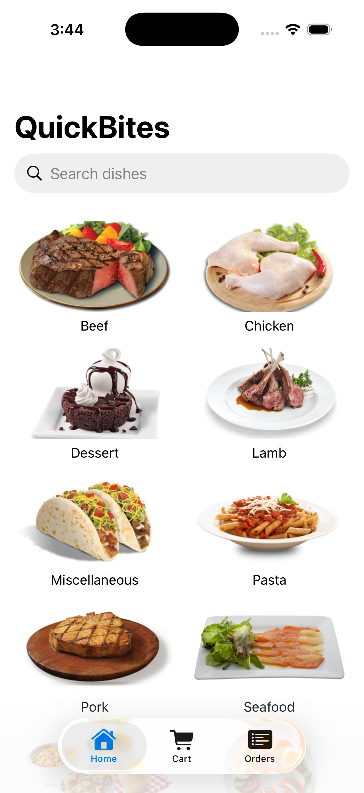
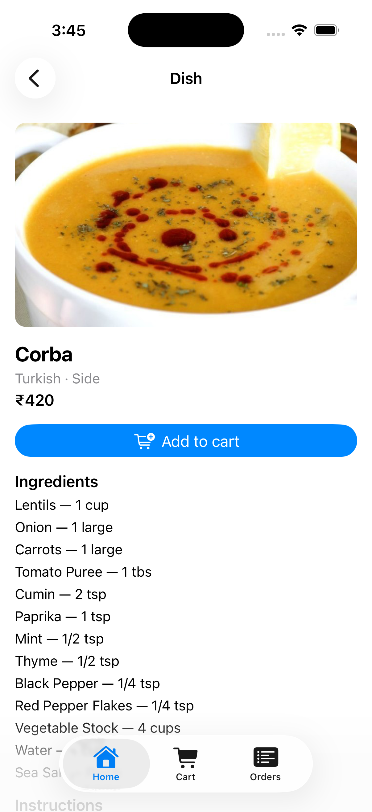
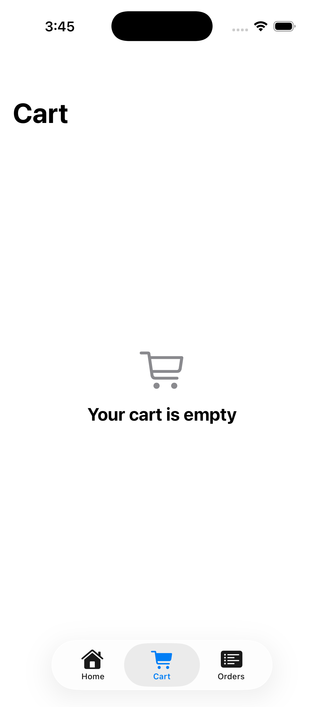
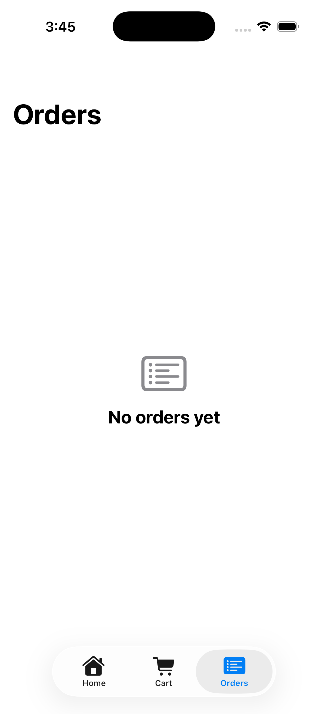

# QuickBites iOS

**Native iOS · Swift · SwiftUI** — a food discovery and mock-ordering app,
and the iOS sibling of [QuickBites for Android](https://github.com/NikethNath/quickbites)
(Kotlin + Jetpack Compose). Same product, same offline-first architecture,
built natively for each platform.

The twist: **developed entirely without owning a Mac.** The core logic lives
in a platform-independent Swift package that builds and unit-tests on Linux;
the SwiftUI app is built, tested, and screenshotted on GitHub Actions macOS
runners (project generated with XcodeGen, simulator driven with `simctl`).
Same approach I used to ship the iOS build of
[Aim Ranked](https://github.com/NikethNath/perfect_mobile_aim_trainer).

> **Status: Built.** Every claim in this README is true of the code as it
> stands — see the roadmap below.

## What it does

Browse a real food catalog ([TheMealDB](https://www.themealdb.com/api.php)),
search it, view dish details, build a cart, and place mock orders with
persistent order history — fully usable offline once seen. Prices are
synthetic (derived deterministically from dish ids; the API has none) and
checkout is a mock: this is an architecture showcase, not a storefront.

## Architecture

```
                SwiftUI (iOS 17+, NavigationStack)
                     │ observes @Observable view models
                     ▼
          View models — MVVM, @MainActor, sealed
          view state: loading / content / error
                     │ async/await
                     ▼
   ┌────────────── QuickBitesCore (SPM package) ──────────────┐
   │            Repository (offline-first)                     │
   │   actor-isolated JSON cache is the source of truth;       │
   │   network refreshes write through; failures surface       │
   │   as Result while cached data keeps rendering             │
   │        │                          │                       │
   │        ▼                          ▼                       │
   │  CacheStore (actor,        MealDBClient                   │
   │  Codable JSON files)       (URLSession async/await)       │
   └───────────── builds & tests on Linux AND macOS ───────────┘
```

- **Swift end to end**: async/await + structured concurrency, actors for
  cache isolation, `Codable` DTOs, no third-party dependencies
- **SwiftUI** (iOS 17+): `NavigationStack`, `@Observable` view models,
  `AsyncImage`, dark mode, Dynamic Type–friendly layouts
- **Offline-first**: the cache is the single source of truth — same
  semantics as the Android sibling's Room-backed repository
- **CI is the Mac**: `swift test` on ubuntu *and* macos runners for the
  core; XcodeGen + `xcodebuild` + iOS Simulator for the app target

## Screens

Captured on GitHub Actions' macOS runner — iPhone 17 Simulator, live data
from TheMealDB, no local Mac involved.

| Home | Dish detail |
|---|---|
|  |  |

| Cart | Orders |
|---|---|
|  |  |

| Screen | Purpose |
|---|---|
| Home | Category grid + search |
| Browse | Dishes in a category / search results |
| Dish detail | Image, ingredients, instructions, add to cart |
| Cart | Quantity steppers, itemized total, mock checkout |
| Orders | Order history, expandable line items |

## Roadmap

- [x] Spec and architecture (this README)
- [x] `QuickBitesCore` SPM package skeleton; CI running `swift test` on ubuntu + macos
- [x] DTOs + `MealDBClient` with injected HTTP transport, unit tests
- [x] Actor-isolated `CacheStore` + offline-first repositories, unit tests
- [x] XcodeGen project + SwiftUI app shell building on macOS CI
- [x] Home + Browse + Search
- [x] Dish detail
- [x] Cart, mock checkout, order history
- [x] Polish: dark mode, empty/error states, accessibility labels
- [x] Simulator screenshots in CI + final README

## Testing

CI (`.github/workflows/ci.yml`) runs four jobs on every push to `master`/`dev`:

| Job | Runner | What it covers |
|---|---|---|
| `core-linux` | `ubuntu-latest`, official `swift:6.1` container | `QuickBitesCore` unit tests (models, `MealDBClient`, `CacheStore`, both repositories) — proof the business logic is genuinely platform-independent, not just "compiles on Linux" |
| `core-macos` | `macos-latest` | Same `QuickBitesCore` suite, natively on Darwin |
| `app` | `macos-latest` | XcodeGen-generated project, `xcodebuild test` on iOS Simulator — SwiftUI view models against the real repositories wired to a fake transport |
| `screenshots` | `macos-latest`, manual `workflow_dispatch` only | Builds the app, boots a simulator, launches it with `SIMCTL_CHILD_`-prefixed env vars to land on each tab/screen, captures the four PNGs above |

`master` stays green after every commit — the `core-linux` job is the one
that matters most: it's the guarantee that the offline-first architecture
(cache, repositories, network client) has zero hidden dependency on Apple
frameworks, verified on a plain Debian container with no Xcode anywhere
in sight.

## Building

```sh
# Core package — anywhere Swift runs, including Linux:
cd QuickBitesCore && swift build && swift test

# App — macOS with Xcode (or let CI do it):
brew install xcodegen
xcodegen && xcodebuild -scheme QuickBites \
  -destination 'platform=iOS Simulator,name=iPhone 17' build
```
